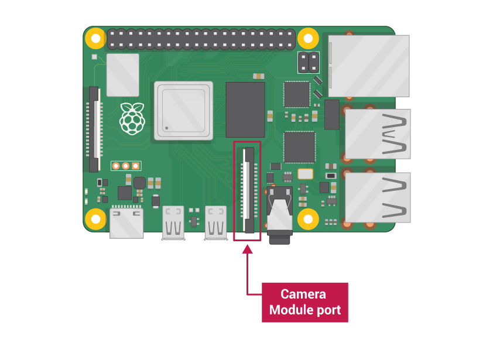

# Raspberry Pi Camera Capture 

## Hardware Guide
1. Connect the camera to the csi port:


2. Open Raspberry pi configurations:


3. Enable camera:


4. Add Tactile Button as described:


## Usage 
1. Run the command below:

```bash
$ python3 main.py
```

2. Push the button to capture image

## Auto run at boot
To run the script automatically after reboot, use cron.

```bash
$ crontab -e
```

use nano editor and add the command:

```text
@reboot python3 <path-to-main-file.py>
```

replace <path-to-main-file.py> with the actual path 
to your main file
